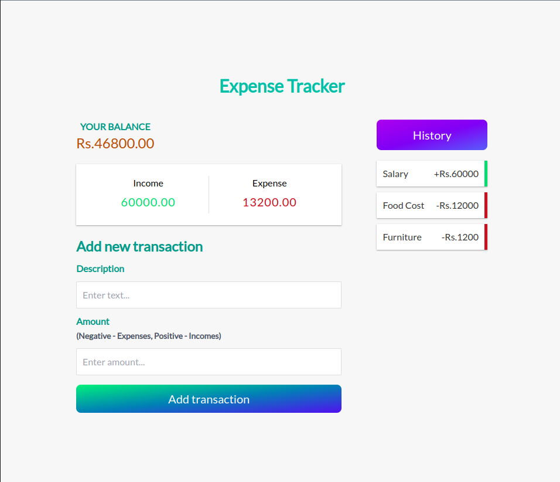

# Expense Tracker

Expense Tracker is a full-stack project with a Node.js/Express.js backend and a React frontend, developed using TypeScript and styled with Tailwind CSS. It enables users to efficiently calculate and manage their expenses.

## Version
0.1.0

## License
Copyright & copy ;  2024 Isuru Ashinsana. All Rights Reserved. <br>
This project is licensed under the [MIT License](LICENSE.txt)

## Features

- Node.js/Express.js backend with MySQL
- React frontend with TypeScript
- Stylish UI design using Tailwind CSS

### ScreenShots



## Getting Started

1. **Clone the repository:**

### Setup
Clone the repository:
   ```bash
   https://github.com/IsuruAshi/MultiStore-Angular